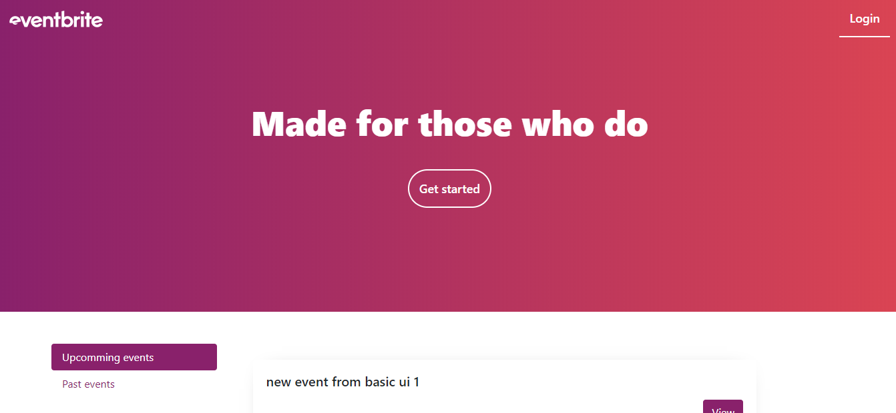
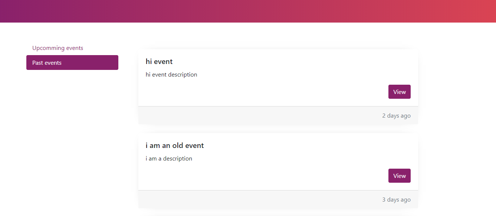
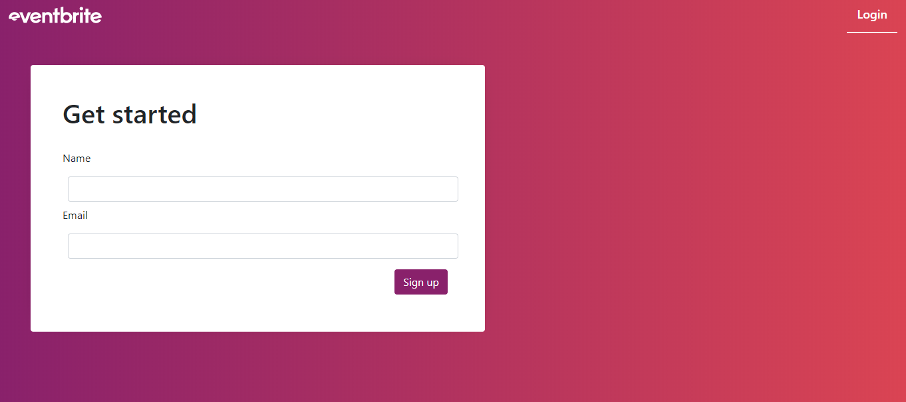
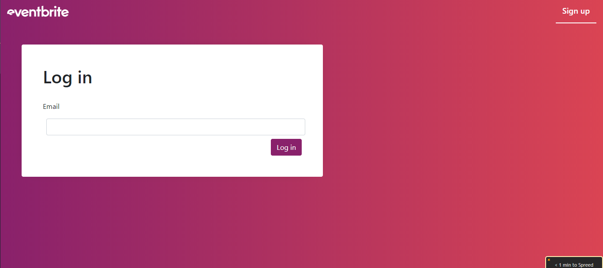
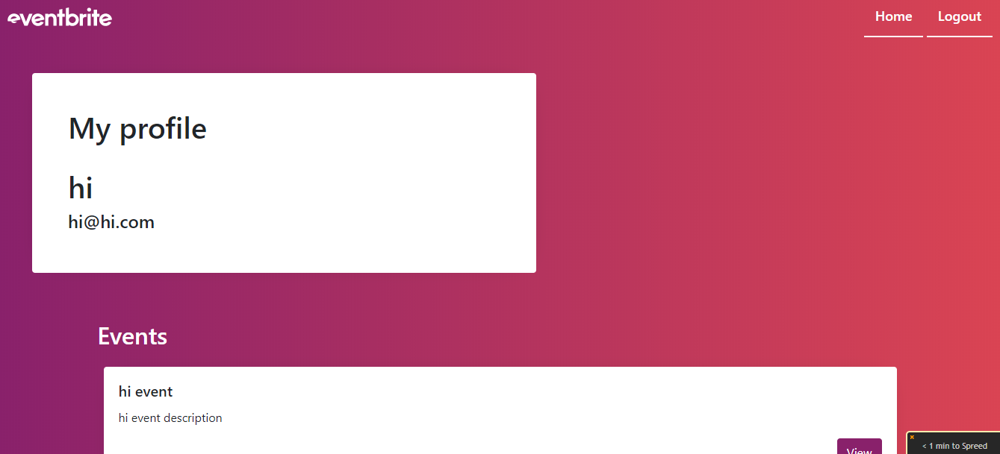
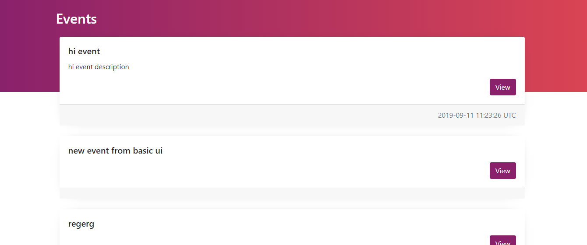
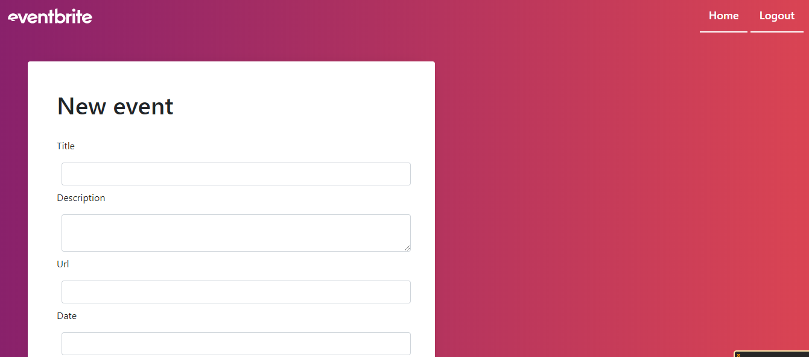

# simple_rails_auth
    This project is a site similar to a private Eventbrite which allows users to create events and then manage user signups. Users can create events and send invitations and parties (sound familiar?). Events take place at a specific date and at a location (which you can just store as a string, like “Andy’s House”).

    A user can create events. A user can attend many events. An event can be attended by many users. This will require you to model many-to-many relationships and also to be very conscious about your foreign keys and class names (hint: you won’t be able to just rely on Rails’ defaults like you have before).

    [learn more](https://www.theodinproject.com/courses/ruby-on-rails/lessons/associations)


## Screenshots

### Home Page





### Sign up Page


### Login Page


### My Profile Page





### After Login: Home Page


### Create Event Page


## Prerequisite

- Ruby 2.6.3
- Rails 5.2.3

## Getting started


```
git clone https://github.com/abdusaid10/private-events.git
cd private-events
```

To get started with the app, clone the repo and then install the needed gems:

```
bundle install --without production
```

Next, migrate the database:

```
rails db:migrate
```

Finally, run the test suite to verify that everything is working correctly:

```
rails test
```

If the test suite passes, you'll be ready to run the app in a local server:

```
rails server
```

## Author
- [@abdusaid10](https://github.com/abdusaid10)
- [@imhta](https://github.com/imhta)
